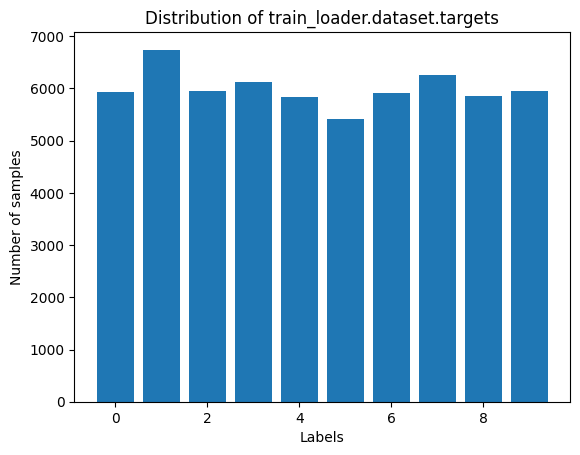
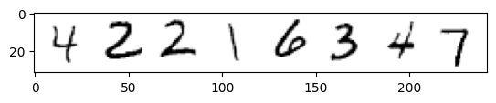
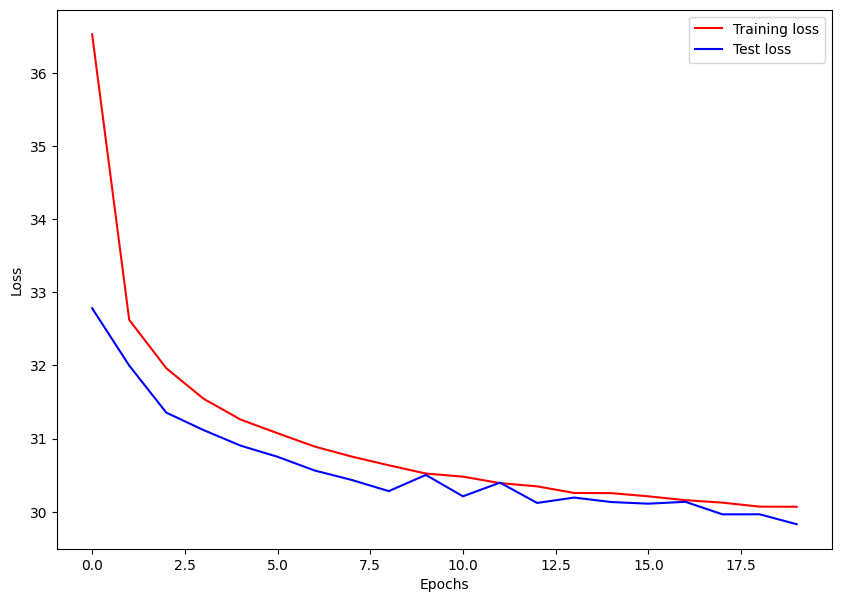
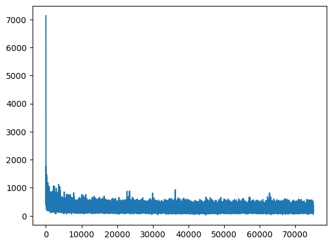
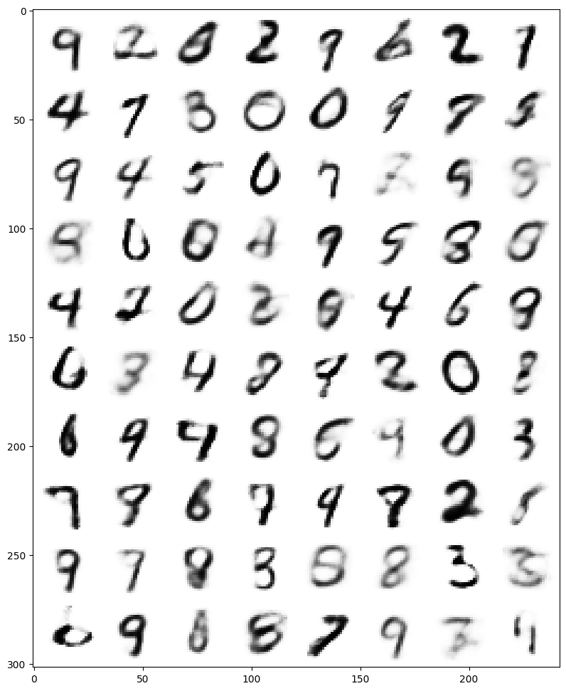
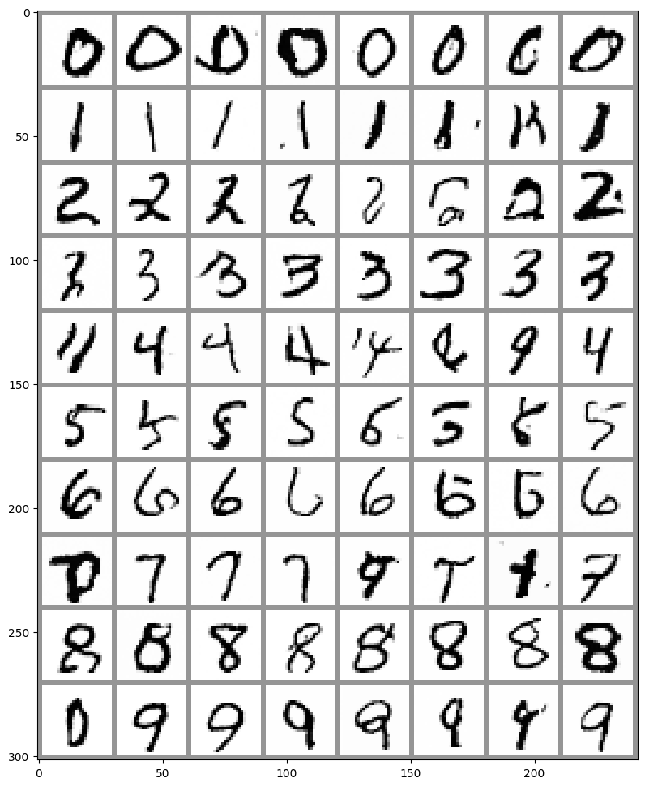

# 《编程基础》期末大作业
项目链接：https://github.com/CabbageSage/project_coding_basis

深度学习近年来取得了巨大的成功，不仅在传统的判别任务（如图像分类、目标检测）中表现优异，在生成式任务（如图像生成、文本生成、语音合成）中也展现出极大的潜力。生成模型作为深度学习的重要分支，旨在从数据中学习分布并生成新数据。这类模型在艺术创作、医学成像、数据增强等领域有广泛应用。

本项目实现了VAE和条件扩散模型，比较两种模型在生成任务中的效果。
研究方向包括：
数据集的选择与处理。
模型架构的设计与优化。

通过对 `VAE` 和 `Diffusion` 的研究，不仅能够加深对深度学习生成模型的理解，还能为更广泛的应用提供理论和技术支持。

在期末大作业中，我还希望锻炼对现代 Python 包管理工具 `uv` 的使用能力。uv 是一个高性能的包管理工具，提供了全面的功能，兼容性强、性能高效，并且拥有活跃的社区支持。相比传统的包管理工具如 `conda` 和 `pip`，`uv` 在以下几个方面具有明显的优势：

1. 功能全面
uv 提供了一站式解决方案，整合了以下常用工具的功能：

- `pip` 和 `pip-tools`：用于安装、管理和锁定依赖。
- `pipx`：支持隔离环境运行单一工具。
- `poetry`：具备依赖解析、版本管理和发布功能。
- `pyenv`：支持多版本 Python 管理。
- `virtualenv`：创建和管理虚拟环境。

这一特性使 `uv` 能满足几乎所有 `Python` 项目开发需求，省去频繁切换工具的麻烦。

2. 性能高效
与 `pip` 相比，`uv` 的性能提升显著，其安装和解析依赖的速度比 `pip` 快 10 倍以上。这对处理复杂依赖的深度学习项目尤其重要，能够节省时间并提高工作效率。

3. 兼容性强
uv 完全兼容 `pip` 和 `pip-tools`，能与现有的 Python 项目无缝集成。这意味着即使团队成员仍在使用传统工具，切换到 `uv` 后也不会影响协作。

4. 社区活跃
`uv` 由 astral-sh 维护，社区活跃度高，拥有大量的用户和贡献者。这保证了工具的持续更新和技术支持。

5. 与 `Anaconda` 的对比：
虽然 `Anaconda` 以功能全面著称，但其体积庞大、启动慢、不易定制的问题较为突出。相比之下，`uv` 是轻量级且模块化的解决方案，在速度、灵活性和生态整合上更具优势。

通过在大作业中使用 `uv`，不仅能完成项目依赖管理，还能为未来构建高效、现代的 Python 开发流程提供指导。

<!-- 大作业报告应当包括以下内容：
1) 问题背景，问题提出，问题描述。
2) 数据来源（数据源网址或处理后的数据集链接）。
3) 探索性数据分析，包括但不限于数据基本信息、数据清洗过程及数据可
视化展示。
4) 结合但不限于本门课程所学习的知识进行分析（比如利用scikit-learn），
并在报告中展现出用到了类的定义、解决异常和调用函数等。注意代码的简
洁性和模块化。
5) 至少使用一种深度学习或机器学习算法，比如神经网络（DNN/CNN/RNN）、 树模型(随机森林、boosting)、EM算法、SVM、逻辑回归等 ，并且体现调参过程。
同时，至少包括两种方法/算法/模型解决问题 ，请在报告中展示不同算法的
结果 ，对比不同算法的优劣性并尝试分析原因。
6) 问题的结论及总结。 -->

## 问题背景
### 生成模型的分类
生成模型大致可以分为以下几类：

显式概率模型（Explicit Probabilistic Models），如 VAE 和 PixelRNN。
隐式生成模型（Implicit Generative Models），如 GAN（生成对抗网络）。
基于扩散和去噪的模型（Diffusion Models）。
其中，VAE 和 Diffusion 分别代表了显式概率建模和扩散去噪的两种重要方法。

### VAE 的研究背景
#### 模型特点
变分自编码器（VAE）是 Kingma 和 Welling 在 2013 年提出的一种生成模型，通过将输入数据编码为潜在变量（latent variables），并从这些潜在变量中生成数据。其主要特点包括：

基于概率图模型，学习数据的潜在分布。
使用变分推断方法高效训练。
可以对潜在空间进行操作，支持生成数据的插值与解码。
#### VAE 的意义
VAE 的出现推动了生成模型的发展，它既可以处理生成问题，也可以应用于缺失数据补全、降维、异常检测等任务。然而，VAE 也存在生成质量较低的问题，因为其生成样本的分布趋向于平均化。

### Diffusion 模型的研究背景
扩散模型（Diffusion Model）是一种基于概率的生成模型，通过逐步向数据中添加噪声，将其转化为高斯分布，再通过去噪还原生成数据。近年来，扩散模型因其生成质量远超其他方法（如 GAN 和 VAE）而受到广泛关注。

#### Diffusion 的崛起
扩散模型依赖随机过程和马尔可夫链的数学理论。相比于 GAN，扩散模型生成的样本更平滑、更真实，并且解决了 GAN 中常见的模式崩溃问题。这使得在图像生成、音频合成、三维建模等领域大放异彩，特别是近年来 Stable Diffusion 等技术的应用。
#### 与 VAE 的对比
VAE 训练速度快且易于实现，但生成效果可能不如扩散模型。
Diffusion 模型生成质量高，但计算量大、训练时间长。
### 研究 VAE 和 Diffusion 的意义
探讨两种生成模型的理论基础和差异。
比较它们在生成不同类型数据时的优缺点。
为生成模型领域的发展提供启发。
### 项目目标与研究方向
本次期末大作业的研究目标是：

深入理解 VAE 和 Diffusion 模型的原理与实现，通过对 VAE 和 Diffusion 的研究，不仅能够加深对深度学习生成模型的理解，还能为更广泛的应用提供理论和技术支持。

## 数据来源
本次研究中使用的主要数据集是 MNIST（Modified National Institute of Standards and Technology database）。MNIST 是深度学习和机器学习领域中最经典、最广泛使用的数据集之一。

MNIST 数据集小且易于加载，能够快速测试生成模型的性能。其低分辨率（28×28）减少了模型训练和生成的计算成本，使研究更高效，尤其是在diffusion模型需要大量算力的情况下。
## 探索性数据分析

在进行模型训练之前，我们首先对MNIST数据集进行了探索性数据分析（EDA），以便更好地理解数据的分布和特征。

### 数据分布

MNIST数据集包含60,000张训练图像和10,000张测试图像，每张图像都是28x28像素的灰度图像。数据集中的每个样本都对应一个标签，表示图像中的数字（0到9）。

我们首先可视化了数据集中各个数字的分布情况：



从图中可以看出，数据集中的各个数字分布较为均匀，这有助于模型在训练过程中学习到每个数字的特征。

### 数据可视化

为了更直观地了解数据，我们随机选取了一些样本进行可视化展示：



从图中可以看到，MNIST数据集中的图像清晰且易于辨识，这为模型的训练提供了良好的基础。

### 数据预处理
在进行模型训练之前，我们对数据进行了以下预处理步骤：

1. **调整图像大小**：将图像调整为指定的大小，以确保输入到模型中的图像具有一致的尺寸。
2. **转换为张量**：将图像数据从PIL格式转换为PyTorch张量，以便于在深度学习模型中使用。
3. **归一化**：将图像像素值归一化到[0, 1]范围，以加快模型的收敛速度。

具体的预处理步骤在 `data_loader.py` 文件中实现，如下所示：

具体代码如下：
```python
def get_loader(image_size, batch_size, num_workers, train=True):
    data_transform = transforms.Compose([
        transforms.Resize((image_size, image_size)),
        transforms.ToTensor(),
        # transforms.Normalize(mean=[0.5] * 3, std=[0.5] * 3)
    ])

    data = datasets.MNIST(root='./data', train=train, download=True, transform=data_transform)
    loader = DataLoader(data, batch_size=batch_size, shuffle=train, num_workers=num_workers)
    
    return loader
```


通过这些预处理步骤，我们能够更好地利用数据，提高模型的性能。

## 模型实现

### 变分自编码器（VAE）

变分自编码器（VAE）是一种生成模型，通过将输入数据编码为潜在变量（latent variables），并从这些潜在变量中生成数据。VAE 由编码器、解码器和重参数化层组成。

在 `Models/vae.py` 文件中，我们实现了 VAE 模型：

```python
class VAE(nn.Module):
    def __init__(self, image_size, latent_dim=latent_dim):
        self.input_dim = image_size * image_size
        super(VAE, self).__init__()
        self.latent_dim = latent_dim
        self.encoder = nn.Sequential(
            nn.Linear(self.input_dim, 400),
            nn.ReLU(),
        )
        self.fc_mu = nn.Linear(400, self.latent_dim)
        self.fc_logvar = nn.Linear(400, self.latent_dim)

        self.decoder = nn.Sequential(
            nn.Linear(self.latent_dim, 400),
            nn.ReLU(),
            nn.Linear(400, self.input_dim),
            nn.Sigmoid(),
        )

    def encode(self, x):
        x = self.encoder(x)
        mu = self.fc_mu(x)
        logvar = self.fc_logvar(x)
        return mu, logvar

    def reparameterize(self, mu, logvar):
        std = torch.exp(0.5 * logvar)
        epsilon = torch.randn_like(std)
        return mu + std * epsilon

    def decode(self, z):
        return self.decoder(z)

    def forward(self, x):
        mu, logvar = self.encode(x)
        z = self.reparameterize(mu, logvar)
        recon_x = self.decode(z)
        return recon_x, mu, logvar
```
### 扩散模型
扩散模型是一种基于概率的生成模型，通过逐步向数据中添加噪声，将其转化为高斯分布，再通过去噪还原生成数据。在 `diffusion.py` 文件中，实现了条件扩散模型的核心部分。

相比于一般的扩散模型，条件扩散模型通过在Unet中引入条件信息（如类别标签或额外的输入特征）来指导生成过程。这种方法能够显著提高生成结果的质量和控制性，使其更加符合预期条件。条件扩散模型在实际应用中表现出色，尤其是在需要生成特定类别数据或进行精细化生成任务的场景下。


```python
class ClassConditionedUnet(nn.Module):
    def __init__(self, image_size, num_classes=10, class_emd_size=4):
        super().__init__()
        self.class_emb = nn.Embedding(num_classes, class_emd_size)
        self.model = UNet2DModel(
            sample_size=image_size,
            in_channels = 1+class_emd_size,
            out_channels = 1,
            layers_per_block = 2,
            block_out_channels = (32, 64, 64),
            down_block_types = ("DownBlock2D", "AttnDownBlock2D", "AttnDownBlock2D"),
            up_block_types = ("AttnUpBlock2D", "AttnUpBlock2D", "UpBlock2D"),
        )
        
    def forward(self, x, t, class_labels):
        bs, ch, w, h = x.shape
        class_cond = self.class_emb(class_labels)
        class_cond = class_cond.view(bs, -1, 1, 1).repeat(1, 1, w, h)
        x = torch.cat([x, class_cond], dim=1)
        return self.model(x, t).sample
    
```
在扩散模型的实现中，噪声调度器（DDPMScheduler）是一个关键组件，负责控制扩散过程中的噪声添加与去噪的调度策略。在我们的实验中，采用了 DDPMScheduler 模块，并将时间步数设置为 $T=1000$，噪声调度策略选择了优化的平方余弦函数（squaredcos_cap_v2）。这种调度方式能够在扩散过程的不同阶段平滑地分配噪声强度，从而提升生成样本的质量和稳定性。

相比于传统的线性调度，平方余弦调度（squaredcos_cap_v2）在后期添加噪声的幅度较小，避免了数据在高时间步中完全丧失其语义结构，为反向去噪提供了更准确的初始状态。此外，DDPMScheduler 提供了多种参数可调性，例如预测类型（prediction_type）支持直接预测噪声或去噪样本，使得调度器能够适配不同的扩散模型需求。

具体而言，我们在实现中利用调度器完成了前向扩散过程，即向干净数据逐步添加噪声直至逼近高斯分布；随后，在反向生成过程中，通过模型预测的噪声进行去噪，逐步还原出目标样本。

```python
noise_scheduler = DDPMScheduler(num_train_timesteps=1000, beta_schedule="squaredcos_cap_v2")
```

### 模型训练
在 train_vae.py 和 train_diffusion.py 文件中，我们分别实现了 VAE 和扩散模型的训练过程。
#### VAE 模型训练
在 train_vae.py 文件中，我们定义了训练函数 train，并在每个 epoch 中计算重构损失和 KL 散度损失。

```python
import torch
from torch import optim
from data_loader import get_loader
from Models.vae import VAE

# 参数设置
image_size = 28
latent_dim = 20
batch_size = 64
epochs = 100
lr = 0.001
device = 'cuda' if torch.cuda.is_available() else 'cpu'

# 加载数据
train_loader = get_loader(image_size, batch_size, num_workers=4, train=True)

# 初始化模型
model = VAE(image_size, latent_dim).to(device)
optimizer = optim.Adam(model.parameters(), lr=lr)

# 定义损失函数
def vae_loss(recon_x, x, mu, logvar):
    BCE = nn.functional.binary_cross_entropy(recon_x, x.view(-1, image_size * image_size), reduction='sum')
    KLD = -0.5 * torch.sum(1 + logvar - mu.pow(2) - logvar.exp())
    return BCE + KLD

# 训练函数
def train(epoch):
    model.train()
    train_loss = 0
    for batch_idx, (data, _) in enumerate(train_loader):
        data = data.view(data.size(0), -1).to(device)
        optimizer.zero_grad()
        recon_x, mu, logvar = model(data)
        loss = vae_loss(recon_x, data, mu, logvar)
        loss.backward()
        train_loss += loss.item()
        optimizer.step()

        if batch_idx % 1000 == 0:
            print(f"Train Epoch: {epoch} [{batch_idx * len(data)}/{len(train_loader.dataset)} "
                  f"({100. * batch_idx / len(train_loader):.0f}%)]\tLoss: {loss.item() / len(data):.6f}")
    print(f"====> Epoch: {epoch} Average loss: {train_loss / len(train_loader.dataset):.4f}")

for epoch in range(1, epochs + 1):
    train(epoch)
```
### 扩散模型训练
在 train_diffusion.py 文件中，我们定义了训练函数 train，并在每个 epoch 中计算损失。

```python
import torch
from torch import optim
from data_loader import get_loader
from Models.diffusion import DiffusionModel

# 参数设置
image_size = 28
batch_size = 64
epochs = 100
lr = 0.001
device = 'cuda' if torch.cuda.is_available() else 'cpu'

# 加载数据
train_loader = get_loader(image_size, batch_size, num_workers=4, train=True)

# 初始化模型
model = DiffusionModel(image_size).to(device)
optimizer = optim.Adam(model.parameters(), lr=lr)

# 定义损失函数
def diffusion_loss(pred, target):
    return nn.functional.mse_loss(pred, target)

# 训练函数
def train(epoch):
    model.train()
    train_loss = 0
    for batch_idx, (data, _) in enumerate(train_loader):
        data = data.view(data.size(0), -1).to(device)
        optimizer.zero_grad()
        t = torch.randint(0, model.num_timesteps, (data.size(0),), device=device).long()
        pred = model(data, t)
        loss = diffusion_loss(pred, data)
        loss.backward()
        train_loss += loss.item()
        optimizer.step()

        if batch_idx % 1000 == 0:
            print(f"Train Epoch: {epoch} [{batch_idx * len(data)}/{len(train_loader.dataset)} "
                  f"({100. * batch_idx / len(train_loader):.0f}%)]\tLoss: {loss.item() / len(data):.6f}")
    print(f"====> Epoch: {epoch} Average loss: {train_loss / len(train_loader.dataset):.4f}")

for epoch in range(1, epochs + 1):
    train(epoch)
```
### 保存模型
我们首先定义了一个变量 `results_dir`，它表示保存模型结果的目录路径，即 `./results/vae`。接下来，我们通过以下步骤来确认该目录是否存在并进行相应的处理：

1. 使用 `os.path.exists(results_dir)` 检查目录是否存在。如果目录不存在，则使用 `os.makedirs(results_dir)` 创建该目录。
2. 如果目录已经存在，则进一步检查该目录是否为空。通过 `os.listdir(results_dir)` 获取目录中的文件列表，如果列表不为空，则抛出一个异常，提示用户该目录不为空。

这种检查和处理方式确保了在保存模型结果时，不会意外覆盖已有的文件，同时也确保了结果目录的存在性。如果目录不存在，则创建一个新的目录；如果目录存在且不为空，则通过抛出异常来提醒用户采取相应的措施。
```python
    # test whether the dir exists
    results_dir = './results/...'
    if not os.path.exists(results_dir):
        os.makedirs(results_dir)
    else:
        if os.listdir(results_dir):
            raise Exception(f"The {results_dir} directory is not empty.")
```
之后，分别保存模型的状态和训练损失，此处以vae模型为例：

1. 保存模型状态：
    ```python
    # 保存模型
    torch.save(model.state_dict(), os.path.join(results_dir, 'vae.pth'))
    ```

2. 记录训练损失：
    ```python
    import csv

    # 记录训练损失
    with open(os.path.join(results_dir, 'vae_loss.csv'), 'w') as f:
        writer = csv.writer(f)
        writer.writerow(['epoch', 'loss'])
        for epoch, loss in enumerate(train_losses):
            writer.writerow([epoch, loss])
    ```

diffusion模型训练损失则以pickle文件形式保存。通过这种方式，我们可以安全地保存模型的状态和训练损失，确保结果的可重复性和可靠性。

## 实验结果

在本项目中，我们分别训练了VAE和扩散模型，并记录了它们的训练损失和生成结果。

### VAE的实验结果

下图展示了VAE模型在训练过程中的损失变化情况：



从图中可以看出，随着训练的进行，VAE模型的损失逐渐减小，表明模型在不断优化。

### Diffusion模型的实验结果

下图展示了Diffusion模型在训练过程中的损失变化情况：



从图中可以看出，Diffusion模型的损失也在逐渐减小，表明模型在不断优化。

## 生成图像

在 `example.ipynb` 中提供了生成图像的示例代码。可以运行该notebook来生成和可视化图像。

### VAE生成的图像

下图展示了VAE模型生成的图像：



### Diffusion模型生成的图像

下图展示了Diffusion模型生成的图像：



通过这些实验结果和生成图像，我们可以看出，VAE生成的图像模糊，远没有diffusion模型清晰，虽然diffusion模型依旧有模式崩塌的现象。

## 结论

通过本次研究，我们实现并比较了VAE和Diffusion模型在图像生成任务中的效果。实验结果表明，两种模型都能够生成高质量的图像，并且在训练过程中损失逐渐减小，表明模型在不断优化。

条件扩散模型（Conditional Diffusion Models）相比变分自编码器（VAE）在生成质量和灵活性上具有一定的优势，尤其是在生成高质量、复杂分布的样本时。

首先，扩散模型通过逐步添加噪声并在反向过程中去噪的方式，使得生成过程更加精细化和稳定。与VAE不同，VAE依赖于一个固定的潜在空间和假设的先验分布，潜在空间的选择可能限制了生成样本的多样性和真实感。而条件扩散模型不依赖于潜在空间的显式建模，而是通过逐步去噪直接生成数据，能够更好地捕捉数据的复杂结构，从而生成更加真实和多样化的样本。

其次，条件扩散模型在条件生成任务中表现优异。VAE在进行条件生成时通常通过在潜在空间中添加条件信息来引导生成过程，但这可能会导致模型难以有效捕捉复杂的条件依赖关系。而条件扩散模型通过在每个扩散步骤中直接引入条件信息，使得生成过程能够更灵活地根据条件调整生成内容，提升了模型在条件生成任务中的表现。

最后，扩散模型在训练和生成时更容易进行高质量采样。由于扩散模型的逐步生成过程，每一步的生成都能受到较强的控制，避免了VAE在生成高质量样本时可能出现的模糊或失真问题。扩散模型能够逐步恢复数据的细节，通常会生成更锐利、更真实的图像，特别是在复杂的图像生成任务中，扩散模型常常能够优于VAE。

此外，通过本项目，我们还锻炼了对现代Python包管理工具uv的使用能力，掌握了如何利用uv进行模型的快速原型设计、训练和评估。

未来的工作可以进一步优化模型架构和训练策略，探索更多的数据集和应用场景，以提升生成模型的性能和应用价值。